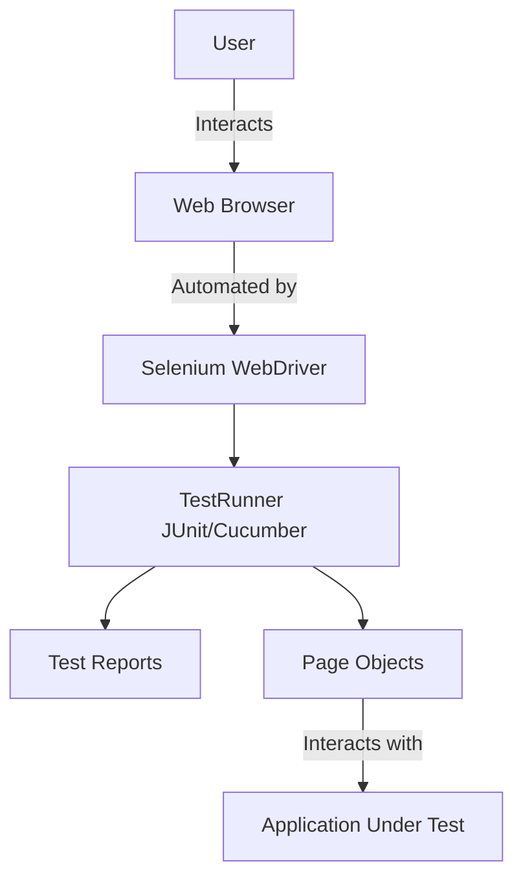

# Java Selenium TestNG Cucumber Framework

Enterprise-grade test automation framework with BDD and TDD support.

[](LICENSE)
[](https://adoptopenjdk.net/)
[](https://www.selenium.dev/)
[](https://cucumber.io/)

---

## Architecture


## Features

- **Selenium WebDriver**  
  Provides robust browser automation for end-to-end UI testing across multiple browsers.

- **TestNG**  
  Enables flexible test execution, grouping, parallelism, and detailed reporting for Java-based tests.

- **Cucumber**  
  Supports Behavior-Driven Development (BDD) with Gherkin syntax, allowing tests to be written in a business-readable format.

- **Page Object Model**  
  Promotes maintainable and reusable code by modeling web pages as classes, encapsulating locators and actions.

- **Environment-specific configuration**  
  Allows easy switching between environments (dev, staging, etc.) using separate configuration files for URLs and credentials.

## Test-Driven Development (TDD)

This framework follows Test-Driven Development (TDD) principles.  
Tests are written before implementing new features or making changes, ensuring that:
- Requirements are clarified up front.
- Code is only written to satisfy defined tests.
- Refactoring is safe due to comprehensive test coverage.

TDD is integrated with BDD and Selenium, supporting automated, reliable, and maintainable test-first development.

## Credentials & Security

Test usernames and passwords are included in this repository for demonstration and automation purposes.  
These credentials are intended for use with test environments only and do not provide access to any sensitive or production systems.  
If you need to use different credentials, you can modify the `dev.properties` file or create your own environment-specific properties file.

## Setup
```bash
# Install dependencies
mvn clean install

# Run all tests
mvn test

# Run specific feature
mvn test -Dcucumber.filter.tags="@smoke"

# Run against different environments
mvn test -Denvironment=staging
```

## Test Structure
- `src/main/java/pages/` - Page Object Model classes
- `src/main/java/utils/` - Utility classes
- `src/main/java/config/` - Configuration management
- `src/test/resources/features/` - Gherkin feature files
- `src/test/resources/environments/` - Environment configs
- `src/test/java/steps/` - Step definitions
- `src/test/java/runners/` - Test runners

## Configuration
See [Configuration Guide](docs/CONFIGURATION.md) for detailed setup.

**Quick Start:**
- Edit `src/test/resources/config.properties` for test settings
- Edit `src/test/resources/environments/dev.properties` for URLs and credentials
- Switch environments with `-Denvironment=staging`

## Reports
- Cucumber HTML reports: `target/cucumber-reports/`
- TestNG reports: `target/surefire-reports/`

## Screenshots in Reports
This framework automatically captures browser screenshots for every scenario—both on pass and fail.

Screenshots are saved as PNG files in the screenshots directory, named after the scenario and its status.
Screenshots are also embedded directly in the Cucumber HTML report for easy viewing and debugging.
How to use:

After running your tests, open the Cucumber HTML report in your browser to view embedded screenshots.
For direct access, browse the screenshots directory for individual PNG files.

[View Latest Cucumber Report](docs/last-cucumber-report.html)
To view the formatted report, download the file and open it locally in your browser, or use the GitHub Pages link if available.

## License

This project is licensed under the MIT License.  
See the [LICENSE](LICENSE) file for details.

---

## 👤 Author

**Carolina Steadham**
- GitHub: [@steadhac](https://github.com/steadhac)
- LinkedIn: [Carolina Steadham](https://linkedin.com/in/carolinacsteadham)

---

<div align="center">

**⭐ Star this repo if you find it helpful!**

Made with ❤️ and Java

</div>